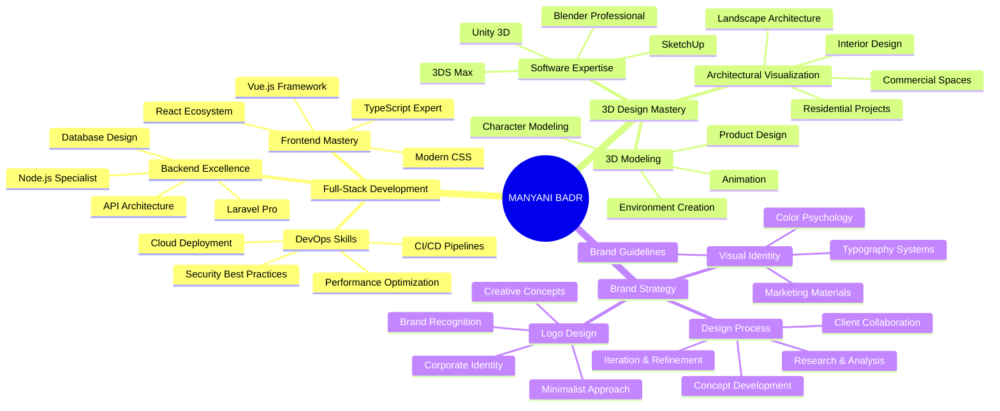

<div align="center">

# 🌟 Welcome to My Digital Universe


</div>

<div align="center">

[](https://git.io/typing-svg)

</div>

---

<div align="center">

## 🎯 About Me

<table>
<tr>
<td width="50%">

```typescript
interface Developer {
  name: string;
  role: string[];
  expertise: TechStack;
  experience: number;
  passion: string[];
  currentProject: string;
}

const manyani: Developer = {
  name: "Manyani Badr",
  role: ["Full-Stack Architect", "3D Designer", "Brand Strategist"],
  expertise: {
    frontend: ["React", "Vue.js", "TypeScript"],
    backend: ["Laravel", "Node.js", "Python"],
    database: ["MySQL", "PostgreSQL", "MongoDB"],
    design: ["3D Modeling", "UI/UX", "Brand Identity"]
  },
  experience: 5,
  passion: ["Clean Code", "Innovation", "User Experience"],
  currentProject: "Building the future, one commit at a time"
};
```

</td>
<td width="50%">


### 🌟 My Mission
*"Transforming ideas into digital reality through code, design, and innovation"*

**📈 Impact Metrics:**
- 🚀 50+ Projects Delivered
- 💡 100+ Creative Solutions
- 🌍 Global Client Base
- ⭐ 5-Star Rating Average

</td>
</tr>
</table>

</div>

---

<div align="center">

## 🛠️ Technology Mastery


<div style="display: flex; justify-content: center; gap: 15px; margin: 20px 0;">


</div>


<div style="display: flex; justify-content: center; gap: 15px; margin: 20px 0;">


</div>


<div style="display: flex; justify-content: center; gap: 15px; margin: 20px 0;">


</div>

</div>

---

<div align="center">

## 📊 GitHub Analytics & Performance

<table>
<tr>
<td width="50%">

### 🔥 Contribution Stats


### 🌟 Streak Power


</td>
<td width="50%">

### 💻 Language Distribution


### 🏆 GitHub Trophies


</td>
</tr>
</table>

### 📈 Activity Graph


</div>

---

<div align="center">

## 🚀 Featured Projects Portfolio

<table>
<tr>
<td width="33%">

### 🌐 Web Development


**🔧 Technologies:**
- React & Next.js
- Laravel & Node.js
- PostgreSQL & Redis
- TailwindCSS & TypeScript

**✨ Achievements:**
- 99.9% Uptime
- <50ms Response Time
- Mobile-First Design
- SEO Optimized

</td>
<td width="33%">

### 🏠 3D House Design


**🎨 Specializations:**
- Architectural Visualization
- Interior Design
- Product Modeling
- VR/AR Integration

**🎯 Deliverables:**
- Photorealistic Renders
- Interactive Walkthroughs
- Technical Drawings
- Material Specifications

</td>
<td width="33%">

### 🎨 Brand Identity


**🌟 Services:**
- Logo Design
- Brand Guidelines
- Visual Identity
- Marketing Materials

**🏆 Portfolio:**
- 200+ Logos Created
- 50+ Brand Systems
- Award-Winning Designs
- Global Recognition

</td>
</tr>
</table>

</div>

---

<div align="center">

## 🎯 Professional Expertise Matrix



</div>

---

<div align="center">

## 🌐 Global Network & Collaboration


<table>
<tr>
<td width="20%">
<a href="https://youtube.com">

</a>
</td>
<td width="20%">
<a href="https://instagram.com">

</a>
</td>
<td width="20%">
<a href="https://linkedin.com">

</a>
</td>
<td width="20%">
<a href="https://discord.com">

</a>
</td>
<td width="20%">
<a href="mailto:your-email@gmail.com">

</a>
</td>
</tr>
</table>

### 💼 Available for:
<div style="display: flex; justify-content: center; gap: 20px; margin: 20px 0;">


</div>

### 📧 Contact Information
**📍 Location:** Casablanca, Morocco  
**🕒 Timezone:** GMT+1  
**💬 Languages:** Arabic, French, English  
**⚡ Response Time:** < 24 hours  

</div>

---

<div align="center">

## 🎉 Fun Zone

 **Visitor Count** 


### 🐍 Contribution Snake


### 🎭 Random Dev Quote


</div>

<div align="center">


</div>
